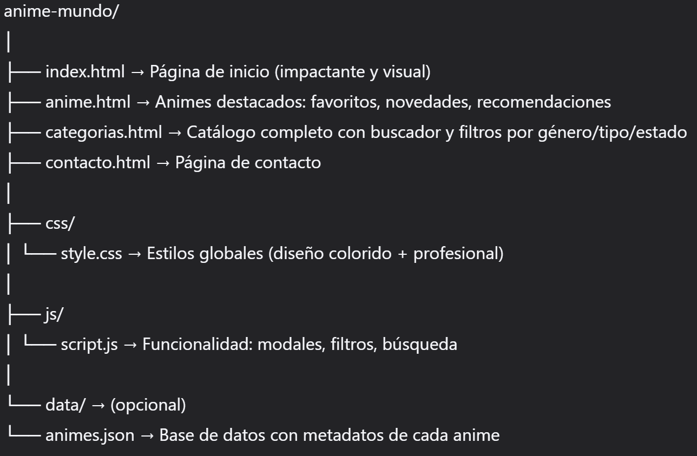

# 🎌 Anime-Mundo – Catálogo de Anime

Este proyecto es un sitio web personal que combina un **portafolio visual de animes destacados** con un **explorador completo por categorías**. Ideal para compartir tu pasión por el anime con estilo y funcionalidad.

---

## 📁 Estructura de Archivos

  

> ✅ Ahora son **4 páginas HTML principales**, organizadas por propósito.

---

## 🖥️ Barra de Navegación (en todas las páginas)

La barra superior incluye:

> - **Inicio** → `index.html`  
> - **Anime** → `anime.html` *(tus selecciones personales)*  
> - **Categorías** → `categorias.html`  

▼ Al pasar el cursor, se despliega un **menú de géneros**:

> Acción | Aventura | Comedia | Drama | Ecchi | Escolar | Fantasía | Histórico | Isekai | Josei | Mecha | Misterio | Música | Psicológico | Romance | Ciencia Ficción | Seinen | Shojo | Shonen | Slice of Life | Deportes | Supernatural | Terror | Yaoi | Yuri

Cada género en el menú lleva directamente a `categorias.html` con el filtro aplicado (ej.: `categorias.html?genero=romance`).

- **Contacto** → `contacto.html`

🔹 Menú **responsive** y funcional en móvil y escritorio.

---

## 📄 Descripción de las Páginas

### 1. `index.html`
- Diseño **impactante y visual**: fondo inspirado en anime + tu logo.
- Mensaje de bienvenida apasionado sobre el anime.
- Breve descripción del sitio.
- Tarjetas destacadas: “Explorar favoritos”, “Ver todas las categorías”.
- Botones grandes: **“Mis Animes”** → `anime.html` | **“Catálogo Completo”** → `categorias.html` | **“Contáctame”** → `contacto.html`.

---

### 2. `anime.html` → **Tus animes personales**
- Enfoque en **calidad, no cantidad**.
- Secciones como:
  - ❤️ **Mis favoritos** (5–10 animes con descripción extendida)
  - 🆕 **Novedades** (últimos añadidos)
  - ⭐ **Recomendaciones especiales**
- Cada anime muestra:
  - Título
  - Imagen (opcional)
  - Sinopsis personalizada (puede ser más larga y emotiva)
  - Géneros y tipo
- Diseño **elegante y colorido**, como un portafolio.

---

### 3. `categorias.html` → **Explorador completo**
- **Buscador avanzado** estilo AnimeFLV:
  - 🔍 Búsqueda por nombre
  - 🎭 Filtro por género
  - 📺 Filtro por tipo (TV, Película, OVA, Especial)
  - 🟢 Filtro por estado (En emisión / Finalizado)
  - 🔤 Orden (Alfabético, Recientes, etc.)
- **Lista dinámica** de todos los animes (incluyendo los de tu lista original).
- **Modal emergente** al hacer clic en cualquier anime:
  - Título
  - Sinopsis breve (1–3 líneas)
  - Géneros, tipo, estado
- Ideal para descubrir contenido sin límites.

---

### 4. `contacto.html`
- Información de contacto (email, redes, etc.).
- Opcional: formulario de contacto simple.

---

## 🧩 Características Clave

- ✅ **Doble enfoque**: portafolio personal (`anime.html`) + catálogo funcional (`categorias.html`).
- ✅ Menú desplegable de géneros integrado en la navegación.
- ✅ Diseño **colorido pero profesional**, inspirado en estética anime.
- ✅ Totalmente **responsive** (móvil + escritorio).
- ✅ Fácil de mantener: los datos pueden centralizarse en `animes.json`.

---

## 🚀 Próximos Pasos (Opcional)

- Añadir imágenes de portada para cada anime.
- Implementar sistema de “favoritos” guardados localmente.
- Conectar con MyAnimeList o AniList API.
- Agregar modo oscuro/claro.

---

> 💡 Este diseño equilibra **emoción y funcionalidad**: celebra tu amor por el anime mientras ofrece una experiencia de usuario intuitiva y moderna.